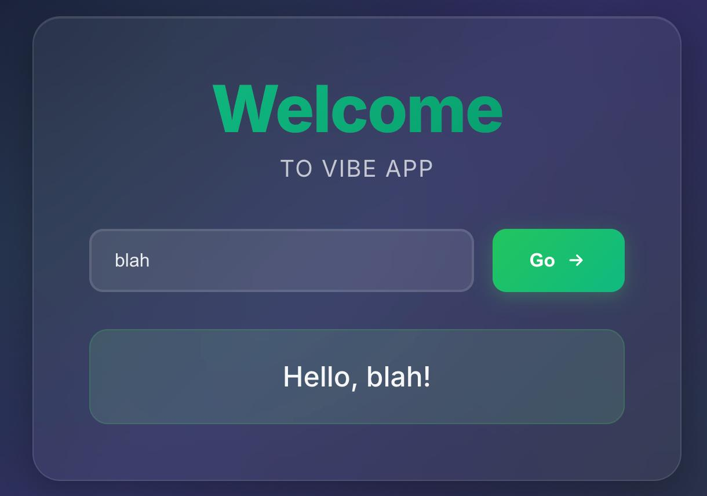

# 2025-12-14 

In today's session i'm trying to build a super simple front end only app.


## Prompt 1:

```
build me a basic react web app that i can deploy in browser. the user needs to be able to write their name in a textbox, and click a "go" button, and the name should be rendered just below the button.
```

## Prompt 2:

Debugging running... turns out i need `npm run install` before `npm run preview`.

```
When i run `npm run preview` i get this error message: Error [ERR_MODULE_NOT_FOUND]: Cannot find package 'vite'
```


## Prompt 3

```
when running the preview vite preview exposes it to localhost:4173 but when i open the browser it comes up as a 404 error
```


### This is what i ended up with:


## Prompt 4

```
DOM Path: div#root > div.app > div.container > div.input-group > button.go-button
Position: top=369px, left=572px, width=86px, height=47px
React Component: Rd
HTML Element: <button class="go-button" data-cursor-element-id="cursor-el-7">Go</button> change this to green
```


## Prompt 5

```
Modernize the theme 10x and make the text appear like it's being typed out.
```



And the typing out stuff works!

to run this:

```
brew install npm
npm install
npm run dev
```

